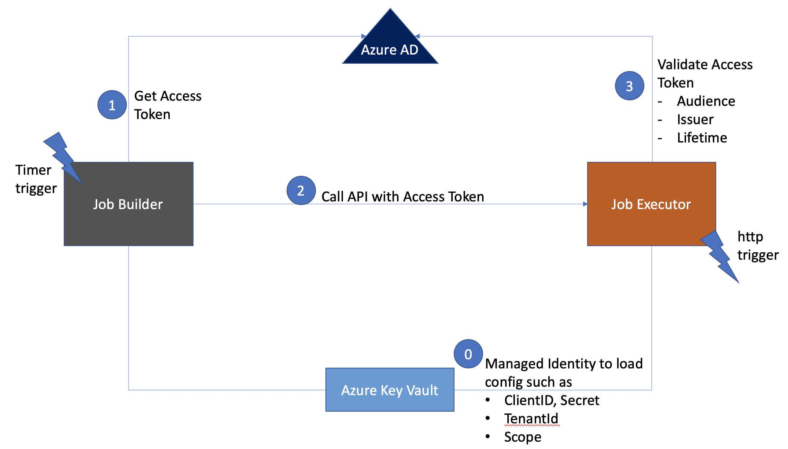

# Chaining Azure Functions with Azure AD API Protection

This is a simple introduction to function chaining in Azure Functions using Azure AD OAuth for API protection.




Steps [Details to Follow]
* Register 2 Apps in Azure AD to signify the API App and the Caller App
* For  local development,  create a local.settings.json with the following
```json
{
  "IsEncrypted": false,
  "Values": {
    "AzureWebJobsStorage": "{}",
    "FUNCTIONS_WORKER_RUNTIME": "dotnet",
    "TENANTID" : "{}",
    "OAUTHCLIENTID" : "{}",
    "OAUTHSECRET": "{}",
    "SCOPE": "{api://clientid/.default"},
    "JOBEXECUTOR2": "{http://xxxx/api/JobExecutor}",
    "AUDIENCE2" : "api://clientid"
  }
}
```
* For execution in Azure, Create a Key Vault with secrets for the following and allow for Azure Functions Managed Identity to retrieve the secrets
    * "TENANTID" 
    * "OAUTHCLIENTID" 
    * "OAUTHSECRET"
    * "SCOPE"
    * "JOBEXECUTOR2"
    * "AUDIENCE2" 


